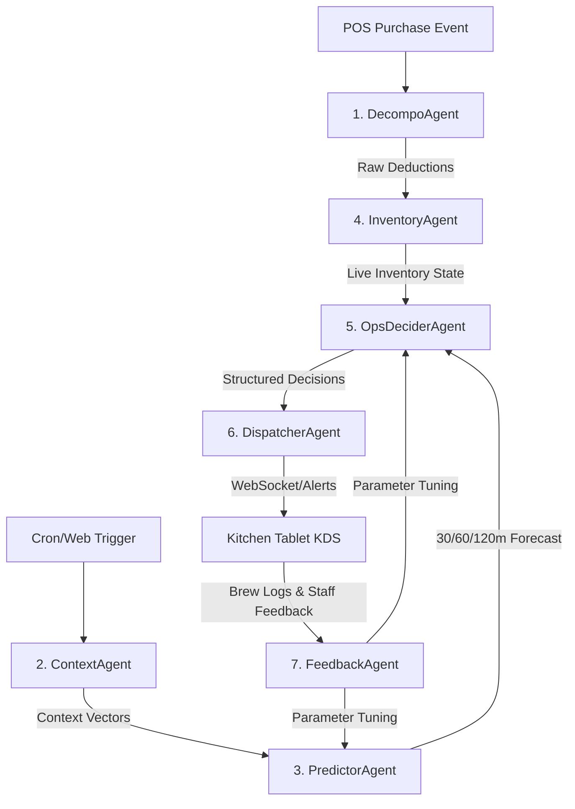

# Multi-Agent AI System Design: Bobaflow Operations Platform

This document describes the multi-agent AI architecture for the Bobaflow platform. To resemble a real-time enterprise operations platform rather than a chatbot, the agents operate in an **event-driven, decoupled pipeline**. They communicate asynchronously via a shared event bus (using Redis Pub/Sub and TimescaleDB logs) rather than through text-based chat windows.

---

## 1. Multi-Agent Overview & Event Pipeline

The platform is powered by seven distinct micro-agents, each focused on a single operational responsibility.



---

## 2. Detailed Agent Specifications

### 2.1 Ingestion & Decomposition Agent (`DecompoAgent`)
*   **Name:** `DecompoAgent`
*   **Purpose:** Convert unstructured or semi-structured POS transaction items into precise raw ingredient deductions based on shop recipes.
*   **Input:** JSON transaction payload from the POS system (e.g., Square, Shopify).
*   **Output:** List of raw ingredient deductions (grams of pearls, milliliters of tea base, units of cups/straws) written to the shared database.
*   **Tools it uses:** Recipe Schema Library (JSON schema lookup), Database Write Tool.
*   **Memory:** Stateless. It references the current version of the store's Recipe Database.
*   **Decision Process:** Parses menu items and modifiers (e.g., "extra pearls", "large size"), queries the corresponding recipe BOM (Bill of Materials) multipliers, and computes the exact physical quantity deducted.
*   **Prompt:**
    ```yaml
    System Prompt: |
      You are the Recipe Decomposition Service. Your task is to parse POS transaction items and resolve them into specific ingredient deductions. Use the standard recipe schema mapping. If an item is modified (e.g. 'extra tapioca'), increase the base deduction by the multiplier (1.5x). Return raw numeric lists in JSON format.
    ```
*   **Example Response:**
    ```json
    {
      "transaction_id": "tx_887192",
      "deductions": [
        { "ingredient": "tapioca_pearls", "qty_grams": 60.0 },
        { "ingredient": "black_tea_base", "qty_ml": 250.0 },
        { "ingredient": "fructose_syrup", "qty_ml": 30.0 }
      ]
    }
    ```

---

### 2.2 Context Enrichment Agent (`ContextAgent`)
*   **Name:** `ContextAgent`
*   **Purpose:** Gather and synthesize external contextual data (weather, temperature, school schedules, local public events) to tag the store's operations environment.
*   **Input:** Location coordinates, timestamp, current date.
*   **Output:** Context Vector JSON containing weather metrics, precipitation, calendar indicators, and local event status scores.
*   **Tools it uses:** OpenWeatherMap API tool, Local Google Calendar API tool, Scraping/Eventbrite API tool.
*   **Memory:** Caches current weather and calendar data in Redis (TTL: 15 minutes) to avoid redundant API calling.
*   **Decision Process:** On trigger, retrieves external data, evaluates proximity and operational impact scores (e.g., a concert 2 blocks away gets a high local event score, while one 5 miles away is filtered out).
*   **Prompt:**
    ```yaml
    System Prompt: |
      You are the Context Enrichment Agent. Analyze the coordinates and current timestamp to return a normalized context vector. Standardize precipitation as continuous floats and calendar flags as booleans. Compute local event index based on proximity and scale.
    ```
*   **Example Response:**
    ```json
    {
      "timestamp": "2026-06-23T15:20:00Z",
      "weather": { "temp_c": 19.5, "rain_intensity_mm": 2.1, "sky_condition": "rainy" },
      "calendar": { "school_in_session": true, "is_holiday": false },
      "local_events": { "active_event_nearby": true, "event_type": "concert", "crowd_estimate_score": 0.8 }
    }
    ```

---

### 2.3 Demand Forecasting Agent (`PredictorAgent`)
*   **Name:** `PredictorAgent`
*   **Purpose:** Calculate numerical demand expectations for the $t+30$, $t+60$, and $t+120$ minute windows for each ingredient.
*   **Input:** Historical sales averages, context vectors, and recent transaction velocities (last 10m/30m/60m).
*   **Output:** Continuous demand projections representing estimated cup sales per category.
*   **Tools it uses:** LightGBM Model Inference Engine, Database Read Tool.
*   **Memory:** Accesses historical database indices and recent velocity arrays stored in Redis.
*   **Decision Process:** Executes mathematical inference using the loaded model weights, combining historical baseline values with the context vector shift and recent real-time velocity coefficients.
*   **Prompt (for model parameter management/inference wrapper):**
    ```yaml
    System Prompt: |
      You are the Predictive Inference Agent. Run the ML forecast for the specified intervals. If the weather event is 'rainy' and temperature is < 20C, apply the rain-scale modifier to warm beverages. Return structured prediction outputs.
    ```
*   **Example Response:**
    ```json
    {
      "model_version": "v1.4.2",
      "predictions": {
        "tapioca_pearls": { "t30": 12.5, "t60": 34.2, "t120": 48.0 },
        "black_tea_base": { "t30": 15.0, "t60": 41.0, "t120": 58.4 }
      }
    }
    ```

---

### 2.4 Inventory State Tracking Agent (`InventoryAgent`)
*   **Name:** `InventoryAgent`
*   **Purpose:** Track active prepared ingredient volumes, subtract real-time sales deductions, monitor batch expiries, and integrate manual kitchen events.
*   **Input:** Ingredient deductions, brew started/completed logs, manual calibration adjustments.
*   **Output:** Estimated active inventory state JSON including remaining shelf-lives.
*   **Tools it uses:** Redis State Updater, Database Write/Read Tools.
*   **Memory:** Maintains state in Redis (primary source of truth for the active inventory table).
*   **Decision Process:** Reconciles POS deductions against the FIFO (First-In, First-Out) stack of cooked batches. If an active batch passes its expiration timestamp, it automatically flags it as expired and deducts it.
*   **Prompt:**
    ```yaml
    System Prompt: |
      You are the Real-time Inventory Ledger. Track cooked batches using FIFO. When a brew completion is logged, push the quantity and the shelf-life timestamp to the stack. Apply POS deductions to the oldest active batch first.
    ```
*   **Example Response:**
    ```json
    {
      "ingredient": "tapioca_pearls",
      "total_qty_grams": 950,
      "batches": [
        { "batch_id": "b_7721", "qty_grams": 150, "expires_at": "2026-06-23T16:45:00Z" },
        { "batch_id": "b_7722", "qty_grams": 800, "expires_at": "2026-06-23T19:15:00Z" }
      ],
      "active_brewing": { "quantity": 2000, "ready_at": "2026-06-23T16:05:00Z" }
    }
    ```

---

### 2.5 Kitchen Operations Decision Agent (`OpsDeciderAgent`)
*   **Name:** `OpsDeciderAgent`
*   **Purpose:** Analyze current stock vs. forecasted demand to generate discrete, binary operational decisions (e.g. Brew Now, Wait, Warn).
*   **Input:** Inventory state, active brew countdowns, and forecasted demand vectors.
*   **Output:** Recommendation event specifying action parameters.
*   **Tools it uses:** Decision Tree Logic Engine, Database Log Tool.
*   **Memory:** Reads recent recommendation actions to avoid duplicate notifications (de-duplication and cool-down memory).
*   **Decision Process:** Compares forecasted consumption during the brew window ($t + T_{\text{cook}}$) against active stock. If a shortfall occurs before a new batch can be cooked, it issues a `BREW_NOW` command.
*   **Prompt:**
    ```yaml
    System Prompt: |
      You are the Operational Decider. Compare forecasted demand vectors with current inventory stacks. Take into account cooking lead times (Pearls: 50m, Tea: 15m). Trigger BREW_NOW if stock will dip below safety levels before a new brew can complete.
    ```
*   **Example Response:**
    ```json
    {
      "action_trigger": "BREW_NOW",
      "ingredient": "tapioca_pearls",
      "quantity_batches": 1,
      "target_volume_g": 2000,
      "expected_depletion_timestamp": "2026-06-23T16:45:00Z",
      "urgency_level": "CRITICAL",
      "brewing_lead_time_mins": 50
    }
    ```

---

### 2.6 Explanation & Dispatch Agent (`DispatcherAgent`)
*   **Name:** `DispatcherAgent`
*   **Purpose:** Convert structured decision payloads and contextual markers into high-urgency, readable instructions for kitchen workers and broadcast them.
*   **Input:** Ops decision JSON, Context vector, Store metadata.
*   **Output:** WebSocket packet with notification text and visual telemetry.
*   **Tools it uses:** Gemini LLM API, WebSocket Broadcast Tool.
*   **Memory:** Context-aware prompts feed on the last 3 notifications sent to ensure stylistic variety.
*   **Decision Process:** Feeds data fields into a target prompt template, calls Gemini to get a concise explanation, wraps it in the WebSocket template, and emits it to the shop's client tablet.
*   **Prompt:**
    ```yaml
    System Prompt: |
      You are the Kitchen Dispatcher. Convert the structured JSON decision payload into a clear, direct, operational instruction for kitchen staff. Explain WHY they need to act, citing specific metrics (runout time, forecast triggers, weather, calendar). Keep sentences short. Use bold highlights for key terms.
    ```
*   **Example Response:**
    ```json
    {
      "alert_id": "evt_900212",
      "target_screen": "kitchen_terminal_main",
      "audio_tone": "warning_chime_high",
      "card_title": "COOK PEARLS IMMEDIATELY",
      "action_payload": { "action": "START_BREW", "ingredient": "tapioca_pearls" },
      "display_text": "Start cooking **1 batch (2kg) of pearls** now. Current stock will run out at **16:45** during the high school rush. A new batch takes **50 minutes** to cook; starting now prevents a 20-minute stockout."
    }
    ```

---

### 2.7 Post-Operational Learning Agent (`FeedbackAgent`)
*   **Name:** `FeedbackAgent`
*   **Purpose:** Review daily outcomes, calculate forecasting error rates (MAPE), track wasted ingredients, analyze rejected recommendations, and optimize decision models.
*   **Input:** Daily transaction history, recommendation log, recommendation feedback log, waste logs.
*   **Output:** Model weight calibration updates, optimized safety buffer constants, operational performance report.
*   **Tools it uses:** Database Analytics Reader, Python Optimization Script Executor, Model Parameter Writer.
*   **Memory:** Persists long-term performance logs over months to identify multi-week seasonal drift.
*   **Decision Process:** Runs batch analyses at close of business. Measures error curves. If recommendations were ignored by staff, it identifies if the refusal was due to inaccurate forecasts (prompting model retraining) or crew fatigue (prompting alert sensitivity adjustments).
*   **Prompt:**
    ```yaml
    System Prompt: |
      You are the Post-Operational Auditor. Analyze the daily metrics log. Identify periods of stockouts and ingredient wastage. Review instances where recommendations were rejected by staff, determine root causes, and output parameter adjustments.
    ```
*   **Example Response:**
    ```json
    {
      "analysis_date": "2026-06-23",
      "waste_recorded_grams": 4500,
      "stockout_minutes": 15,
      "staff_acceptance_rate": 0.88,
      "adjustments": {
        "pearl_safety_buffer_factor": 1.15,
        "model_retraining_triggered": false,
        "alert_cooldown_adjustment_secs": 120
      }
    }
    ```
