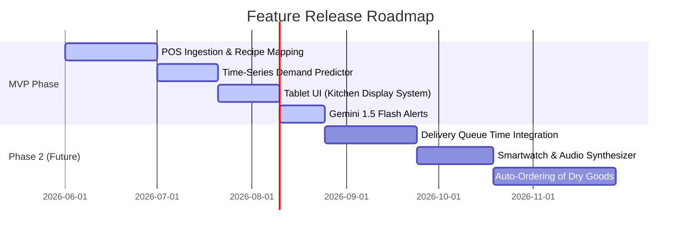

# Product Requirements Document (PRD)

## Project: Bubble Tea AI Operations Agent (Code Name: "Bobaflow")
**Document Version:** 1.0.0  
**Author:** Senior AI Architect & Principal Software Engineer  
**Status:** Under Review  
**Date:** June 23, 2026  

---

## 1. Executive Summary
"Bobaflow" is a real-time AI Operations Agent designed for bubble tea shops to optimize the preparation of short-shelf-life ingredients (tapioca pearls and tea bases). By integrating live sales data with weather patterns, calendar events, and operational histories, Bobaflow predicts ingredient demand in 30, 60, and 120-minute windows. It guides kitchen staff via real-time notifications on when to cook fresh batches and explains the "why" behind every decision. The target outcome is to eliminate customer-facing stockouts while reducing daily ingredient wastage by at least 30%.

---

## 2. Business Problem & Opportunity
Bubble tea stores rely on two main prepared components: tapioca pearls (4-hour shelf life, 50-minute cook time) and brewed tea bases (6-hour shelf life, 15-minute brew time). 

```
                                  +-----------------------+
                                  | The Operational Gap   |
                                  +-----------+-----------+
                                              |
                     +------------------------+------------------------+
                     v                                                 v
         [ Under-Preparation ]                              [ Over-Preparation ]
  - pearls run out during peak hours                 - excess batches brewed near closing
  - customers leave due to 20-30 min wait            - expired ingredients must be thrown out
  - lost revenue & damaged brand reputation          - high material waste eats net profits
```

Because cook times are long, staff must anticipate demand far in advance. Manual prediction leads to high operational inconsistency, human error, and significant financial leakage.

---

## 3. Target Users & Personas

We target three distinct operational roles within the store environment:

| Persona | Role | Primary Goal | Key Challenge |
| :--- | :--- | :--- | :--- |
| **Kitchen Crew (Boba Chef)** | Prepares ingredients, operates boilers, and packs drinks. | Keep up with ticket volume; avoid runs on ingredients. | Hard to monitor front-of-house sales while cooking in the back. Avoids complex software. |
| **Store Manager** | Controls store P&L, schedules staff, handles customer complaints. | Minimize waste costs; ensure customer satisfaction. | Hard to train staff to predict demand; lacks tools to track intra-day waste patterns. |
| **Franchise / Multi-Unit Owner** | Oversees operations across 5–50 locations. | Standardize operations; maximize profit margins. | Disconnect between different store managers' operational styles. |

---

## 4. User Stories

### Kitchen Crew
*   **As a Boba Chef,** I want to get a loud, clear, visual alert on the kitchen tablet when I need to start boiling pearls, so that I don't run out during peak times.
*   **As a Boba Chef,** I want to log that I have started cooking a batch of tea or pearls with a single tap, so that I don't have to wash my hands or type on a keyboard while working.

### Store Manager
*   **As a Store Manager,** I want to see the exact reasoning (e.g., "high school letting out + hot weather") behind a brewing recommendation, so that I can override it if I know of a localized event the AI isn't aware of.
*   **As a Store Manager,** I want to view a daily report showing how much tea and pearls were discarded at the end of their shelf lives, so that I can measure the financial cost of waste.

### Franchise Owner
*   **As a Franchise Owner,** I want to see a unified dashboard comparing waste percentages across all my stores, so that I can identify locations that need operational retraining.

---

## 5. Functional Requirements

### 5.1 Real-Time Ingestion & Inventory Tracking
*   **FR-1.1:** The system MUST parse POS transaction webhooks in real-time ($< 2$ seconds latency) and map menu items to raw ingredient deductions based on configurable recipes.
*   **FR-1.2:** The system MUST maintain a live estimation of prepared pearl stock (grams) and tea base volume (milliliters).
*   **FR-1.3:** The system MUST support manual recalibration inputs from staff to correct estimated stock levels (e.g., manual audit says 1200g remaining instead of predicted 1000g).

### 5.2 Demand Forecasting Engine
*   **FR-2.1:** The system MUST generate rolling demand forecasts for $t+30$, $t+60$, and $t+120$ minutes.
*   **FR-2.2:** The forecasting model MUST incorporate external variables: hour of day, day of week, precipitation, current temperature, and local calendar events (e.g., public holidays, school semesters).

### 5.3 Alerting & Explanations
*   **FR-3.1:** The system MUST broadcast recommendations to kitchen tablets when a shortfall is predicted before the required cook time.
*   **FR-3.2:** Every alert MUST include a natural language explanation generated by the LLM describing the shortfall time, current stock, and external context.
*   **FR-3.3:** The system MUST include audible alarms on the tablet with configurable pitches and volumes.

### 5.4 Kitchen Operational Logging
*   **FR-4.1:** The KDS (Kitchen Display System) UI MUST provide simple tap targets to log the start and completion of a cook event.
*   **FR-4.2:** The system MUST track expiry count-down timers for all active ingredient batches.

---

## 6. Non-Functional Requirements

### 6.1 Performance & Latency
*   **NFR-1.1:** Live POS deduction and state update latency MUST be $< 3$ seconds from transaction confirmation to KDS inventory update.
*   **NFR-1.2:** LLM explanation generation time MUST be $< 2.5$ seconds to prevent delayed alert dispatches.

### 6.2 Reliability & Offline Mode
*   **NFR-2.1:** The kitchen tablet interface MUST remain operational offline. If the cloud database is unreachable, it must fall back to a local rule-based engine and cache events for later sync.
*   **NFR-2.2:** System availability target is 99.9% during standard store operational hours (typically 10:00 AM – 11:00 PM).

### 6.3 Usability & Physical Environment
*   **NFR-3.1:** The kitchen UI targets must be at least $64\text{px} \times 64\text{px}$ to facilitate easy tapping with damp fingers.
*   **NFR-3.2:** The dashboard MUST support a high-contrast dark mode to remain readable under harsh kitchen fluorescent lighting.

---

## 7. AI Agent Responsibilities

The AI Agent acts as an autonomous operations co-pilot with the following scope:

```
+---------------------------------------------------------------------------------+
|                              AI Agent Loop                                      |
+---------------------------------------------------------------------------------+
|  1. PERCEIVE: Ingest POS stream, weather changes, and kitchen log events.        |
|  2. ESTIMATE: Calculate current inventory shelf-life decay & volumes.           |
|  3. PREDICT: Run LightGBM regression to project sales curves for 30/60/120m.     |
|  4. REASON: Evaluate inventory paths vs. sales curves to detect shortfalls.      |
|  5. COMMUNICATE: Draft targeted, empathetic operational alerts via Gemini.       |
|  6. LEARN: Compare recommendations with staff actions to self-tune thresholds.  |
+---------------------------------------------------------------------------------+
```

*   **Boundary Constraints:** The agent recommends actions but does not automate physical processes. It cannot purchase inventory or message suppliers without human-in-the-loop validation.

---

## 8. Technical Architecture (Conceptual)

*   **API Layer:** FastAPI (Python) hosting prediction and reasoning routers.
*   **Cache:** Redis storing the ephemeral state (active cooks, live stock).
*   **Primary DB:** TimescaleDB storing analytical history, POS transactions, and agent recommendations.
*   **GenAI Engine:** Gemini 1.5 Flash accessed via structured schemas (JSON mode) to build explanation cards.

---

## 9. MVP Features vs. Future Scope



### 9.1 MVP Feature Set (V1.0)
*   Real-time POS parser (Standard JSON payload input).
*   Basic Recipe mapping dashboard (modify pearl/tea quantities per drink).
*   FastAPI backend with LightGBM forecaster.
*   Single-store React tablet interface with high-contrast alert modals.
*   Manual override/log tools for waste and batch completions.

### 9.2 Future Scope (V2.0+)
*   **Delivery Queue Integration:** Adjusting forecasting models during delivery spikes (e.g., DoorDash peak delivery times).
*   **IoT Boiler Integration:** Connecting to smart induction cookers to automatically detect when water boils and log brew events without manual button presses.
*   **Multi-Store Analytics:** Manager level comparison dashboard.
*   **Voice Interface:** Kitchen crew can say "Hey Boba, I started 1 batch of pearls" instead of touching the screen.

---

## 10. Success Metrics

To validate the product's effectiveness, the following Key Performance Indicators (KPIs) will be monitored:

| Metric Name | Calculation Method | Target Baseline | Goal |
| :--- | :--- | :--- | :--- |
| **Ingredient Waste Ratio** | $\frac{\text{Wasted Ingredient Weight}}{\text{Total Cooked Ingredient Weight}}$ | 25% – 35% | **< 8%** |
| **Stockout Incidents** | Hours per week where high-demand items are sold out | 4 hours/week | **< 10 mins/week** |
| **Staff Adherence Rate** | $\frac{\text{Accepted Recommendations}}{\text{Total Action Recommendations}}$ | N/A | **> 85%** |
| **Forecast Accuracy (MAPE)**| Mean Absolute Percentage Error on $t+60$ sales | N/A | **< 15%** |

---

## 11. Risks, Mitigation, & Assumptions

### 11.1 Risks & Mitigation
*   **Risk:** Kitchen staff find logging brews too tedious and stop updating the app, leading to inaccurate inventory tracking.
    *   *Mitigation:* Keep interaction minimal. Log starts with a single tap. Use tap counts for batches rather than text inputs. Integrate sound reminders to log completions.
*   **Risk:** Flaky internet disconnects the tablet during busy hours.
    *   *Mitigation:* Leverage Service Workers and local indexedDB storage. The app must continue counting down local active batches and estimating stock locally.

### 11.2 Assumptions
*   **Assumption 1:** Store menu items have fixed standard recipes (e.g., a "Classic Milk Tea" always uses 200ml black tea, 40g pearls).
*   **Assumption 2:** The store has a tablet or terminal in the kitchen area accessible by the crew.

---

## 12. Edge Cases

A product built for physical operations must handle real-world exceptions:

1.  **The Mega-Order:** A customer walks in and buys 45 cups of bubble tea for an office party.
    *   *System Action:* The system registers the sudden POS spike, recognizes it as an anomaly, triggers an immediate critical alert to cook pearls, and prompts the manager to confirm if this is a one-off order (so it doesn't skew next week's forecasting models).
2.  **Unlogged Cooking Events:** Staff boils pearls but forgets to log the start.
    *   *System Action:* If the POS register continues to process bubble tea orders, but the system believes pearl inventory is at zero, the UI will display a prompt: *"We noticed pearl sales are active, but inventory is 0g. Did you brew a new batch? [Log Retroactively]"*.
3.  **End of Day Decay:** A batch of pearls is brewed at 9:30 PM, but the store closes at 10:00 PM.
    *   *System Action:* The decision engine is bounded by the store operating hours. If $t + T_{\text{cook}} > \text{Closing Time} - 30\text{m}$, the system automatically suppresses "Cook" recommendations to prevent guaranteed waste.
