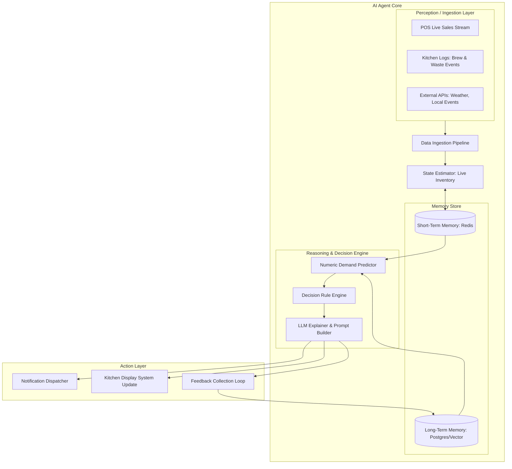
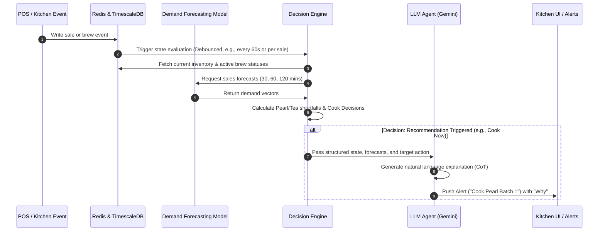
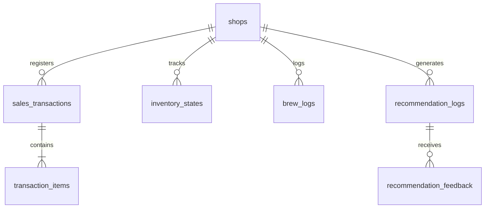

# System Architecture: Bubble Tea AI Operations Agent

This document outlines the complete end-to-end system architecture, AI workflows, database models, and deployment strategy for the Bubble Tea AI Operations Agent. The system acts as a real-time "AI Operations Manager" to optimize ingredient brewing (tapioca pearls and tea bases) to eliminate stockouts while minimizing ingredient waste.

---

## 1. System Overview & Core Challenge

Bubble tea ingredients have short shelf lives once prepared:
*   **Tapioca Pearls:** Cook time $\approx 50$ minutes (boiling, simmering, resting). Shelf life $\approx 4$ hours (becomes mushy/hard thereafter).
*   **Tea Bases (Black/Green/Oolong):** Brew time $\approx 15-20$ minutes. Shelf life $\approx 6$ hours (oxidizes and loses flavor).

### Optimization Trade-offs
```
                      +-------------------+
                      |   Brew Decision   |
                      +---------+---------+
                                |
        +-----------------------+-----------------------+
        |                                               |
        v                                               v
[ Brew Too Late / Too Little ]           [ Brew Too Early / Too Much ]
  - Stockouts & long wait times            - Expired ingredients
  - Angry customers & lost sales           - Wasted material & labor
  - Lower operational throughput           - Reduced profit margins
```

---

## 2. Agent Architecture

The AI Agent is designed around a **Sense-Plan-Act** loop, operating as a hybrid system that combines deterministic business logic, statistical forecasting, and an LLM-based reasoning and explanation engine.



### Components of the Agent
1.  **Perception (Sensors):**
    *   **POS stream listener:** Ingests itemized transactions in real-time.
    *   **Kitchen terminal:** Captures events like "brewed 1 batch tapioca pearls" or "discarded 0.5 batch green tea".
    *   **Context fetcher:** Integrates temperature, rain forecasts, and local calendar events.
2.  **Memory:**
    *   **Short-Term Memory (STM):** Tracks current inventory levels, ongoing brew processes (e.g., a batch of pearls currently boiling and ready in 20 minutes), and recent sales velocities (10, 30 min windows).
    *   **Long-Term Memory (LTM):** Stores historical sales data, recommendation logs (what the agent proposed), action logs (what the staff did), and outcome feedback (did they run out or throw pearls away?).
3.  **Brain (Reasoning & Decision Engine):**
    *   **Demand Predictor:** Generates numeric demand forecasts for $t+30, t+60, t+120$ minutes.
    *   **Decision Engine:** Evaluates current inventory projection against demand forecasts, taking into account cook lead times and shelf lives.
    *   **LLM Explainer:** Takes raw numbers, predictions, and rules, and formats them into an actionable, empathetic, and highly persuasive natural language recommendation.
4.  **Actuators:**
    *   **Audio/Visual Alerts:** In-store smart speaker announcements or flashes on the kitchen tablet.
    *   **Interactive Notifications:** Mobile push notifications containing "Cook/Wait" options.

---

## 3. Technology Stack

A robust, developer-friendly, and cost-effective stack tailored for real-time responsiveness.

| Layer | Technology | Rationale |
| :--- | :--- | :--- |
| **Frontend** | React (Next.js / Vite) + Tailwind CSS + shadcn/ui | Fast rendering, responsive, charts support (Recharts), UI component library. |
| **Backend** | Node.js (TypeScript) or FastAPI (Python) | Node.js for high-concurrency WebSocket connections; Python if statistical model training runs in-process. *Recommendation: FastAPI (Python) to keep AI/forecasting logic in the same language.* |
| **Database (Time-Series)** | TimescaleDB (PostgreSQL Extension) | Relational database support combined with high-performance time-series tables (hypertables) for sales and inventory tracking. |
| **Database (Caching/State)**| Redis | Real-time pub/sub for sales events and fast state caching of inventory and active brews. |
| **AI Models** | LightGBM / XGBoost + Gemini 1.5 Flash | LightGBM for fast, tabular, localized demand forecasting. Gemini 1.5 Flash for low-latency, low-cost reasoning and explanation generation. |
| **Real-time Sync** | WebSockets (Socket.io) | Direct real-time updates to kitchen tablets and dashboards without polling. |
| **Deployment** | Docker containers on AWS ECS / GCP Cloud Run | Easily containerized and scaled. Local edge nodes or lightweight tablets run in the cloud with offline-resiliency features. |

---

## 4. AI Workflow & Algorithms



### Step 4.1: Live Inventory Estimation (State Estimator)
Because bubble tea shops do not scan pearls out of inventory as they are consumed, the agent uses a **Dynamic Recipe Bill of Materials (BOM) deduction**:
$$\text{Est. Pearl Inventory}(t) = \text{Initial Brew Vol} - \sum (\text{Qty Sold} \times \text{Pearl Recipe Portion}) - \text{Wastage}$$

For example, a Medium Taro Bubble Tea deducts 40g of pearls and 200ml of Black Tea Base.

### Step 4.2: Demand Forecasting (The Numeric Brain)
A LightGBM regressor outputs the forecasted count of cups sold per ingredient category for the intervals:
*   $\hat{D}_{30}$ (next 30 mins)
*   $\hat{D}_{60}$ (next 60 mins)
*   $\hat{D}_{120}$ (next 120 mins)

**Features inputted:**
*   Recent velocity: Sales in last 10, 30, and 60 minutes.
*   Temporal features: Hour of day, day of week, season, holiday status.
*   Weather features: Temperature, rain intensity, humidity.
*   Local context: Nearby school calendars, concert events.

### Step 4.3: Decision Engine Logic
Let:
*   $I_{\text{curr}}$ = Current estimated pearl stock (grams)
*   $T_{\text{cook}}$ = Pearl cook time (approx. 50 minutes)
*   $T_{\text{shelf}}$ = Pearl shelf-life remaining (varies per active batch, max 240 mins)
*   $B_{\text{size}}$ = Standard brew batch size (e.g., 2000g)
*   $S$ = Safety buffer factor (e.g., 1.2x)

A recommendation to **"Cook Batch Now"** is triggered if:
$$\text{Expected Stock at } (t + T_{\text{cook}}) < \text{Safety Buffer}$$
Where:
$$\text{Expected Stock at } (t + T_{\text{cook}}) = I_{\text{curr}} - \text{Forecasted Demand during } T_{\text{cook}} + \text{Brews finishing before } (t + T_{\text{cook}}) - \text{Expired inventory during } T_{\text{cook}}$$

### Step 4.4: LLM Reasoning & Explainability (Prompt Engineering)
When a cook decision is recommended, a prompt is generated for the LLM:

```yaml
System Prompt: You are a seasoned Bubble Tea Shop Operations Manager. Your job is to tell kitchen staff when to brew fresh batches of tapioca pearls and tea bases. Keep explanations direct, operational, and persuasive. Use shop terminology.

Context:
- Item: Tapioca Pearls
- Current Stock: 800g (Approx. 16 servings left)
- Current Brews in Progress: None
- Cook Time: 50 minutes
- Current Time: Friday 16:15
- Forecasted Demand (next 60m): 35 servings (approx 1750g)
- Weather: Temp dropping, light rain starting (traditionally increases hot/warm milk tea sales by 15%)
- Event: Local high school lets out in 15 mins (16:30)

Recommendation: COOK 1 BATCH (1500g) OF PEARLS IMMEDIATELY.
```

**LLM Output (Example Alert):**
> **"Cook 1 batch of tapioca pearls immediately."**
> *   **Why:** You only have 16 servings of pearls left. High school lets out at 16:30, and weather patterns indicate an uptick in warm tea purchases. A new batch takes 50 minutes to cook. If you don't start brewing now, you will run out of pearls by 16:45, causing a 20-minute stockout during peak after-school rush.

---

## 5. API Design

The backend exposes a WebSocket server for real-time events and a REST API for configuration, historical review, and manual adjustments.

### 5.1 Real-Time WebSocket API (Staff & Kitchen Devices)
*   **Subscribe:** `/ws/shop/{shop_id}`
*   **Server Push Events:**
    *   `inventory_update`: Broadcasts updated inventory estimates.
    *   `recommendation_alert`: Broadcasts a cook/brew warning.
        ```json
        {
          "event": "recommendation_alert",
          "timestamp": "2026-06-23T15:20:00Z",
          "payload": {
            "id": "rec_982741",
            "ingredient": "tapioca_pearls",
            "action": "BREW_NOW",
            "quantity_batches": 1,
            "urgency": "CRITICAL",
            "eta_limit_mins": 10,
            "explanation": "High school rush starts in 15 mins. Current stock runs out in 20 mins. Cook time is 50 mins."
          }
        }
        ```
    *   `active_brew_update`: Broadcasts countdowns of active cooking pots.
*   **Client Emitted Events:**
    *   `start_brew`: Staff logs that they started cooking a batch (starts countdown).
    *   `complete_brew`: Staff logs that a batch has finished and is ready for use.
    *   `waste_log`: Staff logs expired items discarded.

### 5.2 REST API Endpoints
*   `GET /api/v1/dashboard/summary`: Current state of all inventory, alerts, and predictions.
*   `POST /api/v1/kitchen/brew-actions`:
    *   Payload: `{ "ingredient": "tapioca_pearls", "action": "START", "batch_size_grams": 2000 }`
*   `POST /api/v1/recommendations/{id}/feedback`:
    *   Payload: `{ "accepted": true/false, "rejection_reason": "Too busy to start", "actual_action": "Brewed half batch" }`
    *   *Crucial for closed-loop learning.*

---

## 6. Database Schema Design (TimescaleDB)



### Table: `inventory_states` (Hypertable for real-time tracking)
| Column | Type | Description |
| :--- | :--- | :--- |
| `timestamp` | TIMESTAMPTZ | Time of estimate (Primary Key, chunked) |
| `shop_id` | UUID | Foreign Key to shops |
| `ingredient_id` | VARCHAR | e.g., `tapioca_pearls`, `black_tea`, `green_tea` |
| `estimated_qty_grams` | NUMERIC | Estimated usable stock remaining |
| `active_brewing_qty_grams` | NUMERIC | Quantity currently being prepared |
| `nearest_expiry` | TIMESTAMPTZ | Timestamp when the oldest active batch expires |

### Table: `brew_logs` (Tracks cooking events)
| Column | Type | Description |
| :--- | :--- | :--- |
| `id` | UUID | Primary Key |
| `shop_id` | UUID | Foreign Key |
| `ingredient_id` | VARCHAR | e.g., `tapioca_pearls` |
| `started_at` | TIMESTAMPTZ | When cooking started |
| `completed_at` | TIMESTAMPTZ | When batch became available (null if active) |
| `expires_at` | TIMESTAMPTZ | Expected expiry (completed_at + shelf_life) |
| `initial_qty_grams` | NUMERIC | Amount brewed |
| `wasted_qty_grams` | NUMERIC | Amount discarded at expiry |

### Table: `recommendation_logs` (For analysis & feedback loops)
| Column | Type | Description |
| :--- | :--- | :--- |
| `id` | UUID | Primary Key |
| `shop_id` | UUID | Foreign Key |
| `created_at` | TIMESTAMPTZ | Generation time |
| `ingredient_id` | VARCHAR | Ingredient target |
| `action_recommended` | VARCHAR | `COOK_NOW`, `PREPARE_HALF`, `WAIT` |
| `predicted_shortage_at` | TIMESTAMPTZ | When we estimate inventory runs dry |
| `explanation_text` | TEXT | LLM generated reason |
| `model_features_snapshot` | JSONB | Input values (weather, velocity) for offline retraining |

### Table: `recommendation_feedback`
| Column | Type | Description |
| :--- | :--- | :--- |
| `recommendation_id` | UUID | Foreign Key to recommendation_logs |
| `responded_at` | TIMESTAMPTZ | Time staff clicked |
| `action_taken` | VARCHAR | `ACCEPTED`, `IGNORED`, `DELAYED` |
| `delay_minutes` | INTEGER | If delayed, by how long |
| `staff_notes` | TEXT | Qualitative input |

---

## 7. Frontend Interface Design (Kitchen Display System)

The frontend must support a split-screen design matching the fast-paced, wet environment of a bubble tea kitchen. It should emphasize large touch targets, bold alerts, and high-contrast visuals.

```
+------------------------------------------------------------------------------------+
|  [BBT AI OPS MANAGER]  |  Store: Downtown Hub  |  Status: ACTIVE   |  16:15 PM Friday|
+---------------------------------------------------+--------------------------------+
|  ACTIVE ALERTS                                    |  INGREDIENT STATUS             |
|  +---------------------------------------------+  |  - Tapioca Pearls:             |
|  | [CRITICAL] COOK PEARLS IMMEDIATELY          |  |    [||||||......] 800g (16 srv)|
|  | - Runout expected: 16:45 PM (in 30 mins)    |  |    *Expires in: 1h 15m*        |
|  | - Cook time: 50 mins. Delay = stockout.     |  |                                |
|  | Why: High school rush + cool rainy weather  |  |  - Black Tea Base:             |
|  |                                             |  |    [||||||||||||] 4.2L (21 srv)|
|  | [ START COOKING ]         [ SNOOZE (5M) ]   |  |    *Expires in: 3h 40m*        |
|  +---------------------------------------------+  |                                |
|                                                   |  - Green Tea Base:             |
|  ACTIVE COOKING TIMERS                            |  |    [|||.........] 1.1L (5 srv)  |
|  - Tapioca Pearls: None                           |  |    *Expires in: 0h 45m*        |
|  - Black Tea Base: 08:45 remaining [Cancel]       |  |    *ALERT: Brew soon*          |
+---------------------------------------------------+--------------------------------+
|  FORECASTED DEMAND                                                                 |
|  16:30 (30m): 35 cups (School Rush) | 17:00 (60m): 55 cups | 18:00 (120m): 40 cups |
+------------------------------------------------------------------------------------+
```

### Key UI Features
1.  **Big Red Button Actions:** When a "Cook" recommendation is showing, a prominent "Start Cooking" button immediately kicks off a timer on the backend, updating the inventory model.
2.  **Sound Notifications:** High-pitched, friendly chime for warning alerts; distinct buzz for critical alerts.
3.  **Active Cooking Progress:** A progress ring showing time left until current brews are ready.
4.  **Offline State Warning:** Banner indicating if the POS sync or internet connection is down, falling back to local manual sales entry.

---

## 8. Deployment Strategy & Offline Resiliency

Bubble tea shops frequently experience flaky internet connections. The system must not halt operations if the cloud disconnects.

```
       +--------------------------------------------+
       |                  Cloud                     |
       |  - TimescaleDB (Global Analytics)          |
       |  - LLM API (Gemini Cloud Endpoint)         |
       |  - Model Training Pipeline (Airflow)       |
       +---------------------+----------------------+
                             |
                   HTTPS / WebSockets (VPN)
                             |
       +---------------------v----------------------+
       |                In-Store Edge               |
       |  - Local SQLite / DuckDB (Syncs to cloud)  |
       |  - Lightweight Local Forecast Server       |
       |  - Local Redis (State)                     |
       +----------+----------------------+----------+
                  |                      |
                  v                      v
            +-----+----+           +-----+----+
            | POS System |         | KDS Tablet|
            +----------+           +----------+
```

### 8.1 Local Edge Architecture
*   An **In-store Gateway** (e.g., running on a Raspberry Pi or Docker container on the POS manager's local PC) acts as the local buffer.
*   **Offline Mode:** If cloud connection is lost:
    1.  The local Edge server continues tracking POS sales.
    2.  It uses a local, lightweight forecasting fallback (e.g., simple historical averages stored in SQLite) rather than calling the cloud LightGBM model.
    3.  It bypasses the LLM explanation generator and outputs structured alerts (e.g., "Cook Pearls: Stockout projected in 15 mins").
    4.  Once connection is restored, it reconciles all offline transaction history and kitchen logs back to the TimescaleDB cloud.

### 8.2 Closed-Loop Learning Pipeline
Every night at 02:00 AM, a batch cron job runs:
1.  **Calculate Errors:** It checks $\text{Forecasted Demand}$ vs. $\text{Actual Sales}$.
2.  **Identify Waste:** It correlates $\text{Brew Logs}$ + $\text{Waste Logs}$ to find optimal batch decisions vs. actual decisions.
3.  **Retrain Models:** Re-trains the LightGBM model with the new day's sales figures.
4.  **Prompt Optimization:** Evaluates cases where staff ignored recommendation warnings to adjust the thresholds or prompt context rules (e.g., if staff consistently ignore warnings during rainy days because foot traffic drops more than expected, the model adjusts the rain coefficient).
